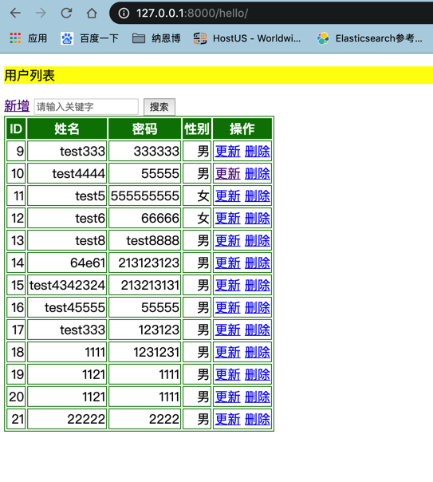
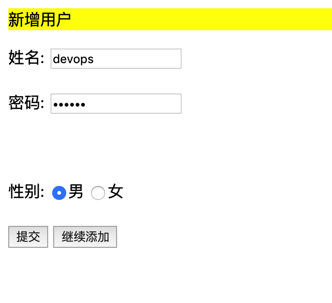
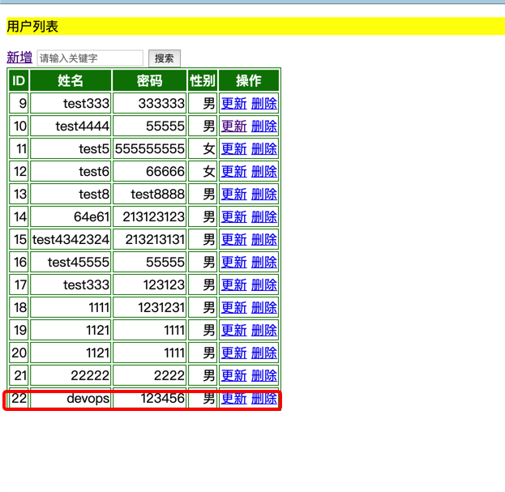
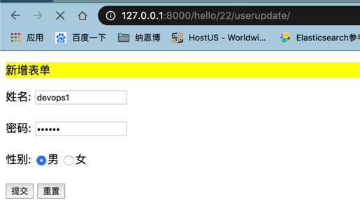
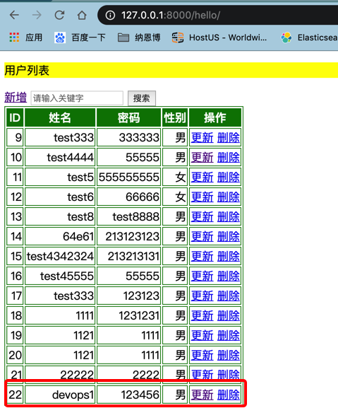
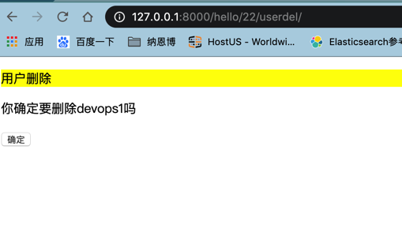
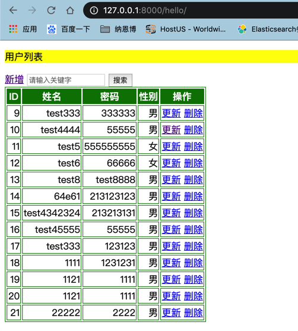

#### 简单的用户管理系统实现用户的增删改查(CBV)

>urls.py
```python
app_name = 'hello'
urlpatterns = [
    path('', views.UserList.as_view(), name='UserList'),
    path('useradd/', views.UserAdd.as_view(), name='UserAdd'),
    # pk 为主键，update根据主键检索数据
    re_path('(?P<pk>[0-9]+)/userupdate/', views.UserUpdate.as_view(), name='UserModify'),
    re_path('(?P<pk>[0-9]+)/userdel/', views.UserDel.as_view(), name='UserDel'),
    re_path('(?P<pk>[0-9]+)/userdetail',views.UserDetail.as_view(), name='UserDetail')
]
```
>views.py
```python
# 创建数据视图
class UserAdd(SuccessMessageMixin,CreateView):
    #get 请求渲染的模板
    template_name = 'hello/UserAdd.html'
    # 数据库类
    model = User
    # 数据库字段名称
    fields = ('name', 'password', 'sex')
    success_message = "%(name)s was created successfully"

    # 成功后跳转
    def get_success_url(self):
        if '_addanother' in self.request.POST:
            return reverse('hello:UserAdd')
        return reverse('hello:UserList')


class UserList(ListView):
    template_name = "hello/UserList.html"
    context_object_name = 'users'
    model = User
    keyword = ""

    # 用户过滤
    def get_queryset(self):
        queryset = super().get_queryset()
        self.keyword = self.request.GET.get("keyword","")
        if self.keyword:
            queryset = queryset.filter(name__icontains=self.keyword)
        return queryset

    def get_context_data(self, *, object_list=None, **kwargs):
        context = super().get_context_data(**kwargs)
        context['keyword'] = self.keyword
        return context

    def get_success_url(self):
        return reverse('hello:index')


class UserUpdate(UpdateView):
    template_name = "hello/UserUpdate.html"
    model = User
    fields = ('name', 'password', 'sex')
    context_object_name = 'users'

    def get_success_url(self):
        return reverse('hello:UserList')


class UserDel(DeleteView):
    template_name = "hello/UserDel.html"
    model = User

    def get_success_url(self):
        return reverse('hello:UserList')


class UserDetail(DetailView):
    template_name = 'hello/UserDetail.html'
    model = User

```
>实现效果
##### List

##### Add



##### Update


##### Delete





