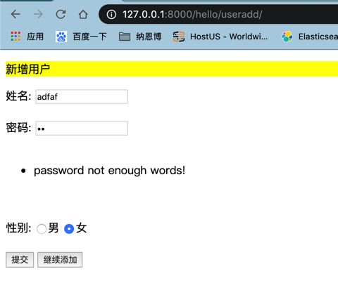
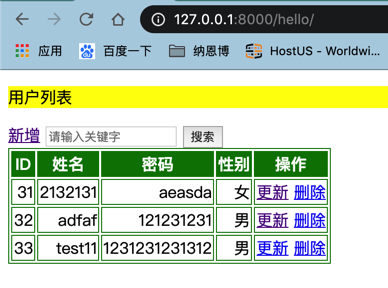

#### 简单的用户管理系统实现用户的增删改查(CBV) +form

>urls.py  没变

>form.py
```python
class UserForm(forms.Form):
    name = forms.CharField(max_length=20,required=True)
    password = forms.CharField(max_length=32,required=True)

    def clean_password(self):
        password = self.cleaned_data['password']
        print(password.split())
        num_password = len(password)
        print('num_password:{}'.format(num_password))
        if num_password < 4:
            print('33334444')
            raise forms.ValidationError('password not enough words!')
        return password
```
>重写Add和Update类
```python

class UserAdd(TemplateView):
    template_name = 'hello/UserAdd.html'
    def post(self,request):
        print(request.POST)
        form = UserForm(request.POST)
        print(form)
        data1 = request.POST
        print(data1)
        data = {'name': data1.get('name'), 'password': data1.get('password'), 'sex': data1.get('sex')}
        if form.is_valid():
            print('表单验证ok')
            try:
                User.objects.create(**data)
                messages = ['{}用户添加成功'.format(data1.get('name'))]
            except Exception as e:
                messages = ['新增用户失败']
                print(e)
                return render(request,'hello/UserAdd.html',{'messages':messages})
            if '_addanother' in self.request.POST:
                return render(request,'hello/UserAdd.html',{'messages':messages})
            return redirect(reverse('hello:UserList'))
        return render(request,'hello/UserAdd.html',{'form':form,'users':data})


class UserUpdate(TemplateView):
    template_name = "hello/UserUpdate.html"
    def get_context_data(self, **kwargs):
        context=super().get_context_data(**kwargs)
        context['users'] = User.objects.get(id=context['pk'])
        return context
    def post(self,request,pk):
        form = UserForm(request.POST)
        data1 = request.POST
        data = {'name': data1.get('name'), 'password': data1.get('password'), 'sex': data1.get('sex')}

        if form.is_valid():
            print('表单验证ok')
            try:
                User.objects.filter(id=pk).update(**data)
            except Exception as e:
                messages = ['更新用户失败']
                return render(request,'hello/UserUpdate.html',{'messages':messages})
            return redirect(reverse('hello:UserList'))
        print(form)
        return render(request,'hello/UserUpdate.html',{'form':form,'users':data})


```
>实现效果
##### Add
密码不足4位


##### Update
密码不足4位



